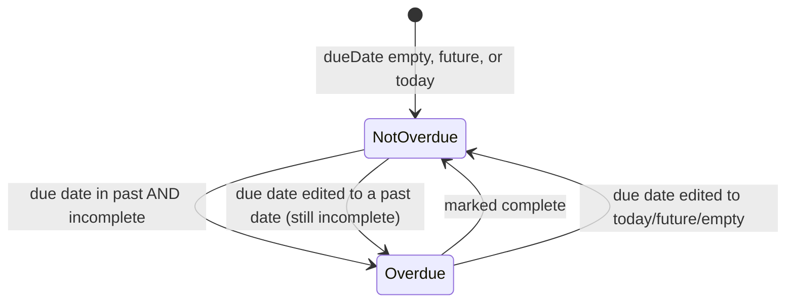

# Phase 1 Data Model: Support for Overdue Todo Items

## Entity: Todo (existing — no schema change)

| Field | Type | Notes |
|-------|------|-------|
| `id` | number | Existing primary key, unchanged |
| `title` | string | Existing, unchanged |
| `dueDate` | string (ISO date) \| null | Existing, optional, unchanged |
| `completed` | 0 \| 1 (boolean-like) | Existing, unchanged |
| `createdAt` | string (ISO datetime) | Existing, used for list ordering, unchanged |

No new fields are added to the `Todo` entity or its backing table. This feature introduces **no
persistence changes**.

## Derived Value: `overdue` (not persisted)

`overdue` is a boolean computed at render time — never stored, never returned by the API.

**Computation rule** (`isOverdue(todo, referenceDate = new Date())`):

```text
overdue = todo.completed is falsy
          AND todo.dueDate is present
          AND calendarDate(todo.dueDate) < calendarDate(referenceDate)
```

| `completed` | `dueDate` | vs. today | `overdue` | Governing requirement |
|-------------|-----------|-----------|-----------|------------------------|
| false | past date | earlier | `true` | FR-001 |
| false | today | same day | `false` | FR-004 |
| false | future date | later | `false` | FR-001 (implicit) |
| false | `null`/unset | n/a | `false` | FR-003 |
| true | any (incl. past) | any | `false` | FR-002 |

**Recomputation triggers**: any render of `TodoCard`, which occurs after add/edit/delete/toggle
(`todos` state changes in `App.js`) or a page load/refresh (initial `fetchTodos`). No timer-based
recomputation (FR-005).

**Ordering**: `overdue` has no effect on sort order. The list remains ordered by `createdAt DESC`
(newest first), as already implemented in `TodoService.getAllTodos()` — unchanged (FR-008).

## State Transitions (derived, not persisted)



These transitions are all re-derivations of the same pure function on each render — there is no
explicit state machine or stored transition history.
